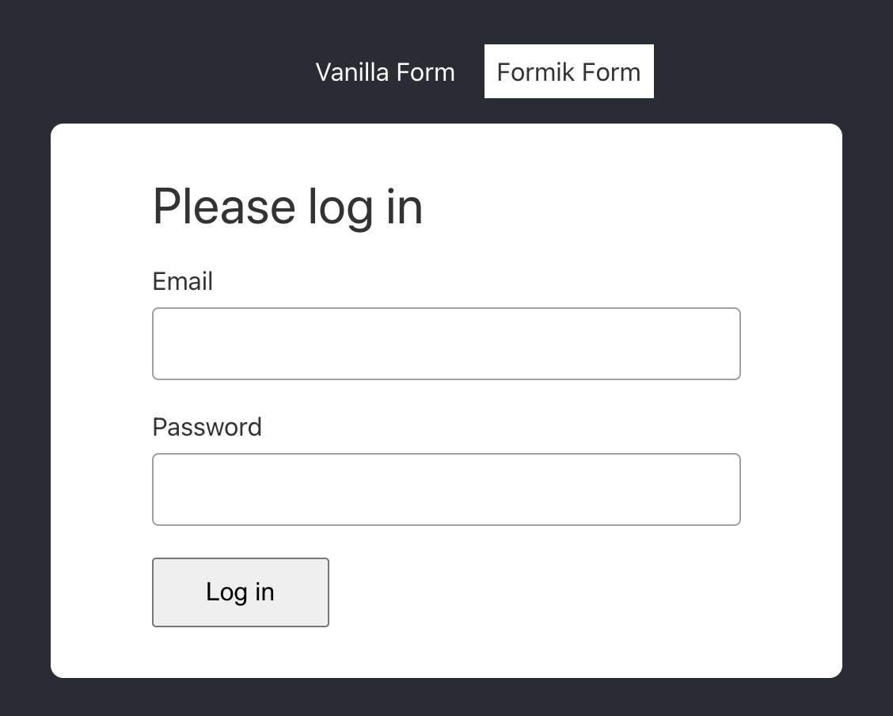

# Managing React forms with Formik (demo app)

This is a demo application that implements a simple login form using vanilla React and using Formik for comparison.

The vanilla React form implementation is in `src/components/vanilla-form`, and the Formik implementation is in `src/components/formik-form`.

This project was bootstrapped with [Create React App](https://github.com/facebook/create-react-app).

## Available scripts

In the project directory, you can run:

### `yarn start`

Runs the app in the development mode.\
Open [http://localhost:3000](http://localhost:3000) to view it in the browser.

The page will reload if you make edits.\
You will also see any lint errors in the console.

### `yarn test`

Launches the test runner in the interactive watch mode.\
See the section about [running tests](https://facebook.github.io/create-react-app/docs/running-tests) for more information.

### `yarn build`

Builds the app for production to the `build` folder.\
It correctly bundles React in production mode and optimizes the build for the best performance.

The build is minified and the filenames include the hashes.\
Your app is ready to be deployed!

See the section about [deployment](https://facebook.github.io/create-react-app/docs/deployment) for more information.
